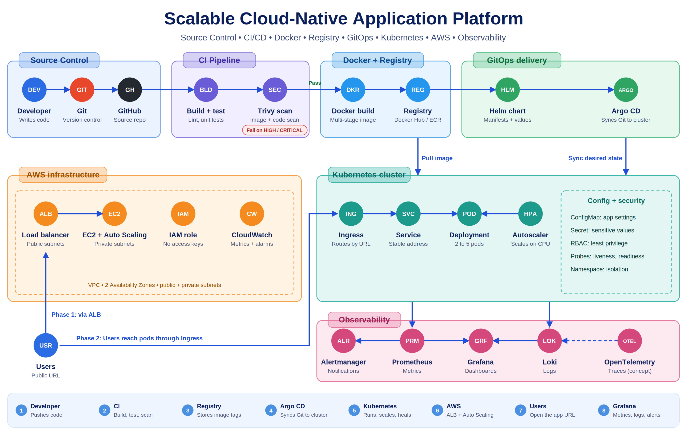

# Scalable Cloud-Native Application Platform

A progressive, stage-by-stage implementation of a production-style cloud-native platform — starting from raw AWS infrastructure and evolving into containerized, GitOps-driven, fully observable workloads on Kubernetes.



---

##  Project Overview

This project demonstrates how an application evolves from a **single-server deployment** into a **scalable, self-healing, observable cloud-native platform**. Rather than adopting tools in isolation, each technology was introduced only when a real operational problem demanded it:

| Problem | Solution Introduced |
|---|---|
| Manual server management | AWS EC2 + Auto Scaling |
| Traffic distribution & availability | Application Load Balancer |
| Inconsistent environments | Docker |
| Too many containers to manage manually | Kubernetes |
| YAML sprawl | Helm |
| Configuration drift between Git & cluster | Argo CD (GitOps) |
| "It works" ≠ "It's healthy" | Prometheus / Grafana / Loki / Alertmanager |

**Core philosophy:** Don't just use the tool — understand *why* it exists.

---

##  Architecture Phases

### Phase 1 — AWS Infrastructure
- Custom **VPC** with 2 Availability Zones, public + private subnets
- **Internet Gateway**, route tables, NAT configuration
- **EC2** instances running the application
- **Application Load Balancer** with target groups & health checks
- **Auto Scaling Groups** with launch templates and scaling policies
- **IAM** roles with least-privilege policies (no access keys on instances)
- **CloudWatch** metrics, logs, and alarms

### Phase 2 — Containerization
- Multi-stage optimized **Dockerfile** with `.dockerignore`
- Image vulnerability scanning
- Pushed to **Docker Hub / Amazon ECR** with semantic version tags

### Phase 3 — Kubernetes Orchestration
- Deployments, Services, ConfigMaps, Secrets
- **Ingress** routing, DNS-based service discovery
- **HPA** based on CPU utilization
- Liveness, Readiness & Startup probes
- Resource requests/limits, RBAC, ServiceAccounts, Namespaces

### Phase 4 — Helm Packaging
- Full chart with templated Deployment, Service, ConfigMap, Ingress & HPA
- Demonstrated install → upgrade → **rollback** workflows

### Phase 5 — GitOps with Argo CD
- Cluster state continuously synced from Git
- Demonstrated auto-sync, drift detection (`OutOfSync`), and Git-based rollback

### Phase 6 — Observability
- **Prometheus** — metric collection (app + cluster)
- **Grafana** — dashboards
- **Loki** — centralized logging
- **Alertmanager** — alert rules & notifications
- **OpenTelemetry** — tracing concepts

---

##  Tech Stack

`AWS` · `Terraform (HCL)` · `JavaScript/Node.js` · `Docker` · `Kubernetes` · `Helm` · `Argo CD` · `Prometheus` · `Grafana` · `Loki` · `Alertmanager` · `GitHub Actions` · `Bash`

---

##  Repository Structure

```text
.
├── docs/            # Architecture diagrams & stage-wise learning logs
├── helm/            # Helm chart for the CineSangeet application
├── infrastructure/  # Terraform / bootstrap scripts for AWS provisioning
├── k8s/             # Kubernetes manifests (Deployments, Services, Ingress, HPA)
├── public/          # Static frontend assets
├── Dockerfile       # Multi-stage container build
├── server.js        # Express application + Prometheus metrics endpoint
└── package.json

```

## Getting Started
Prerequisites
Node.js 18+ & npm
Docker
Minikube or Kind
Helm v3
kubectl
Run Locally
bash

Copy
# Install dependencies
npm install

# Start the application
node server.js
# App available at http://localhost:3000 | Metrics at /metrics
Build & Run Container
bash

Copy
docker build -t cine-sangeet:v1 .
docker run -p 3000:3000 cine-sangeet:v1
Deploy to Kubernetes (via Helm)
bash

Copy
helm install cine-sangeet ./helm/cine-sangeet
kubectl get pods -w


## Operational Scenarios Tested

 Scaling — Increased load, observed ASG/HPA scale-out and scale-in

 Self-healing — Deleted a pod, verified automatic recreation

 Rolling updates — Deployed new version with zero downtime

 Rollback — Faulty deployment reverted to previous stable revision

 GitOps drift — Manually edited live manifest, Argo CD detected OutOfSync and re-synced

 Monitoring — Generated load, observed CPU/memory/app metrics in Grafana

 Troubleshooting — Debugged failed deployments via logs, events & probes

## Key Learnings
Infrastructure first, orchestration second. Understanding VPCs, IAM and load balancing makes Kubernetes feel like a natural next layer rather than a mystery.
GitOps eliminates drift. Treating Git as the single source of truth changed how I think about deployments entirely.
Probes are not optional. Without readiness/liveness probes, self-healing can actually make outages worse.
Observability is a feature. A deployment that succeeds but degrades silently is still a failure.


### Author
Meghana M Building cloud-native infrastructure, one stage at a time.